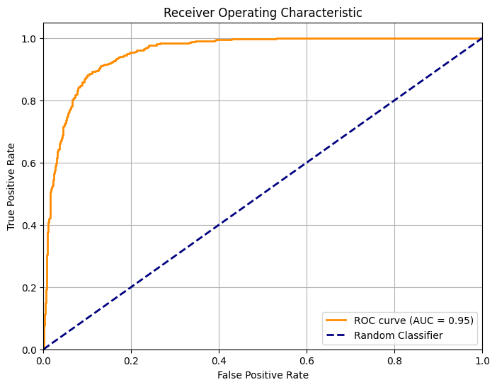

# 🪐 Exoplanet Classification with CNN (Kepler Dataset)

This project uses NASA's Kepler exoplanet dataset to classify celestial objects as either **confirmed exoplanets** or **false positives** or **candidate** using a **1D Convolutional Neural Network (CNN)**. The pipeline includes data cleaning, feature selection, scaling, label encoding, and deep learning model training.

---

## Dataset

**Source:** [Kepler Data on NASA Exoplanet Archive](https://exoplanetarchive.ipac.caltech.edu/)


**Selected Features:**
- `koi_disposition` (Label: `CONFIRMED` / `FALSE POSITIVE`)
- `koi_period`
- `koi_impact`
- `koi_duration`
- `koi_depth`
- `koi_prad`
- `koi_teq`
- `koi_insol`
- `koi_model_snr`
- `koi_steff`
- `koi_slogg`
- `koi_srad`

---

## ⚙️ Workflow

### 1. Load & Inspect Data
- Load CSV using `pandas`
- Explore and select relevant features

### 2. Data Cleaning
- Drop rows with missing values

### 3. Preprocessing
- Scale features using `MinMaxScaler`
- Encode labels using `LabelEncoder` and convert to one-hot vectors
- Reshape input for 1D CNN: `(samples, features, 1)`

### 4. Modeling
- Build a 1D CNN using **TensorFlow/Keras**
- Train to classify: exoplanet vs false positive

---

## Model Input

- **Input Shape:** `(N_samples, 11, 1)`
- **Output:** Softmax activation with 3 neurons  
  (`CONFIRMED` / `FALSE POSITIVE` / `CANDIDATE`)

---

## 🛠️ Setup & Installation

### Option 1: Using Docker (Recommended)

1. **Clone the repository**
   ```bash
   git clone <repository-url>
   cd <repository-name>
   ```

2. **Download the dataset**
   - Download from [NASA Exoplanet Archive](https://exoplanetarchive.ipac.caltech.edu/)
   - Place the CSV file in the `data/` directory

3. **Build and run the Docker container**
   ```bash
   docker build -t exoplanet-classification .
   docker run -p 8888:8888 -p 5000:5000 -p 4200:4200 exoplanet-classification
   ```
   - Port 8888: Jupyter Notebook
   - Port 5000: MLflow UI
   - Port 4200: Prefect UI

### Option 2: Local Setup

1. **Clone the repository**
   ```bash
   git clone <repository-url>
   cd <repository-name>
   ```

2. **Create and activate a virtual environment**
   ```bash
   python -m venv venv
   source venv/bin/activate  # On Windows: venv\Scripts\activate
   ```

3. **Install dependencies**
   ```bash
   pip install -r requirements.txt
   ```

4. **Download the dataset**
   - Download from [NASA Exoplanet Archive](https://exoplanetarchive.ipac.caltech.edu/)
   - Place the CSV file in the `data/` directory

## 🚀 Running the Project

### Using Prefect Workflows

1. **Run the main workflow**

   ```bash
   python -m prefect_flows.flows
   ```

### Monitoring with MLflow

1. **Start the MLflow UI** (if not using Docker)
   ```bash
   mlflow ui --port 5000
   ```

2. **Access the MLflow UI**
   - Open your browser and navigate to [http://localhost:5000](http://localhost:5000)
   - View experiment results, metrics, and artifacts

## Evaluation Metrics

- Accuracy

- Loss

- (Optional) Confusion Matrix, Precision, Recall

## ROC Curve



The ROC curve shows that the model performs exceptionally well, with an AUC of 0.95, indicating strong capability in distinguishing between classes. The curve stays close to the top-left corner, reflecting a high true positive rate and a low false positive rate. In contrast, a diagonal line would represent random guessing (AUC = 0.5), which this model clearly surpasses.

